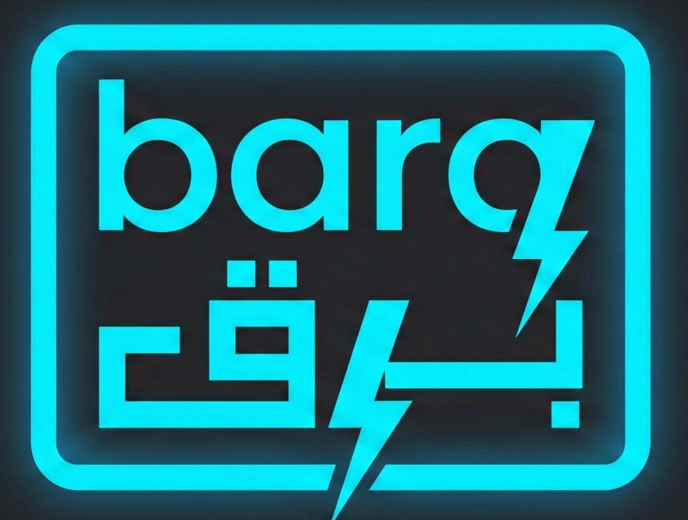

# Barq DB

<p align="center">
  
</p>

<p align="center">
  <b>Blazing-Fast Vector Database for AI Applications</b>
</p>

<p align="center">
  <a href="https://github.com/YASSERRMD/barq-db/blob/main/LICENSE"></a>
  <a href="https://github.com/YASSERRMD/barq-db/releases"></a>
  <a href="https://pypi.org/project/barq-sdk-python/"></a>
</p>

---

Barq is a **high-performance vector database** built in Rust, designed for semantic search, RAG applications, and AI-powered recommendations. It combines dense vector search with BM25 text retrieval in a single, unified API.

## Key Features

- **Vector Search** - HNSW, IVF, and flat indexes with SIMD-optimized distance calculations
- **Hybrid Retrieval** - Combine vector similarity + BM25 keyword search with RRF fusion. Advanced text analysis for multiple languages, including Arabic with root extraction.
- **Multi-Tenancy** - Namespace isolation, RBAC, and per-tenant quotas
- **Cloud-Native** - Sharded architecture with replication and consensus
- **Automated Operations** - Kubernetes operator for seamless deployment, scaling, and storage tiering (Hot/Warm/Cold)
- **Multi-Language SDKs** - Python, TypeScript, Go, and Rust clients

---

## Quick Start

### Start the Server

```bash
# Using Docker (Recommended)
docker-compose up -d

# Or build from source (Rust 1.74+)
cargo run --bin barq-server
```

The API is available at `http://localhost:8080` (HTTP) and `localhost:50051` (gRPC).

---

## SDK Quick Start

Choose your language to get started:

| Language | Package | Documentation |
|----------|---------|---------------|
| **Python** | `pip install barq-sdk-python` | [barq-sdk-python/README.md](./barq-sdk-python/README.md) |
| **TypeScript** | `npm install barq-sdk-ts` | [barq-sdk-ts/README.md](./barq-sdk-ts/README.md) |
| **Go** | `go get github.com/YASSERRMD/barq-db/barq-sdk-go` | [barq-sdk-go/README.md](./barq-sdk-go/README.md) |
| **Rust** | `barq-sdk-rust` (workspace crate) | [barq-sdk-rust/README.md](./barq-sdk-rust/README.md) |

---

### Python

```python
from barq import BarqClient

client = BarqClient("http://localhost:8080", api_key="your-key")

# Create collection
client.create_collection(name="products", dimension=384, metric="Cosine")

# Insert vectors
client.insert_document(
    collection="products",
    id=1,
    vector=[0.1, 0.2, ...],  # 384-dim embedding
    payload={"name": "Widget", "price": 29.99}
)

# Search
results = client.search(collection="products", vector=query_vector, top_k=10)
for r in results:
    print(f"{r['id']}: {r['score']:.4f}")
```

### TypeScript

```typescript
import { BarqClient } from 'barq-sdk-ts';

const client = new BarqClient({ baseUrl: 'http://localhost:8080', apiKey: 'your-key' });

// Create collection
await client.createCollection({ name: 'products', dimension: 384, metric: 'Cosine' });

// Insert & search
const collection = client.collection('products');
await collection.insert(1, vector, { name: 'Widget' });

const results = await collection.search(queryVector, undefined, 10);
results.forEach(r => console.log(`${r.id}: ${r.score}`));
```

### Go

```go
import barq "github.com/YASSERRMD/barq-db/barq-sdk-go"

client := barq.NewClient(barq.Config{
    BaseURL: "http://localhost:8080",
    APIKey:  "your-key",
})

// Create collection
client.CreateCollection(ctx, barq.CreateCollectionRequest{
    Name:      "products",
    Dimension: 384,
    Metric:    "Cosine",
})

// Insert & search
client.Insert(ctx, "products", barq.InsertRequest{ID: 1, Vector: vector})
results, _ := client.Search(ctx, "products", barq.SearchRequest{Vector: queryVec, TopK: 10})
```

### Rust

```rust
use barq_sdk_rust::{BarqClient, DistanceMetric};

let client = BarqClient::new("http://localhost:8080", "your-key");

// Create collection
client.create_collection("products", 384, DistanceMetric::Cosine, None, None).await?;

// Insert & search
let collection = client.collection("products");
collection.insert(1u64, vector, Some(json!({"name": "Widget"}))).await?;

let results = collection.search(Some(query_vec), None, 10, None, None).await?;
```

---

## Core Concepts

### Collections

Collections store vectors with associated metadata. Each collection specifies:
- **Dimension** - Vector size (e.g., 384, 768, 1536)
- **Metric** - Distance function (`L2`, `Cosine`, `Dot`)
- **Index** - Algorithm (`HNSW`, `IVF`, `Flat`)

### Documents

Each document contains:
- **ID** - Unique identifier (string or integer)
- **Vector** - Dense embedding
- **Payload** - JSON metadata for filtering

### Search Types

| Type | Description |
|------|-------------|
| **Vector** | Similarity search using embeddings |
| **Text** | BM25 keyword search |
| **Hybrid** | Combined vector + text with RRF fusion |

---

## Architecture

```
┌─────────────────────────────────────────────────────┐
│                    Barq DB                          │
├─────────────────────────────────────────────────────┤
│  REST API (Axum)  │  gRPC API  │  Admin CLI        │
├───────────────────┴────────────┴────────────────────┤
│                Query Engine                         │
│  ┌─────────┐  ┌─────────┐  ┌─────────────────────┐ │
│  │  HNSW   │  │   IVF   │  │   BM25 + Analyzer   │ │
│  └─────────┘  └─────────┘  └─────────────────────┘ │
├─────────────────────────────────────────────────────┤
│  Storage Engine (WAL + Snapshots + Compaction)     │
├─────────────────────────────────────────────────────┤
│  Cluster Layer (Sharding + Raft Consensus)         │
└─────────────────────────────────────────────────────┘
```

### Crate Structure

| Crate | Description |
|-------|-------------|
| `barq-core` | Data structures, catalog, type system |
| `barq-index` | HNSW, IVF, flat indexes, SIMD kernels |
| `barq-bm25` | Text search engine, analyzers |
| `barq-storage` | WAL, snapshots, persistence |
| `barq-cluster` | Sharding, replication, consensus |
| `barq-api` | HTTP/gRPC APIs, auth, validation |

---

## Configuration

### Environment Variables

| Variable | Default | Description |
|----------|---------|-------------|
| `BARQ_HTTP_PORT` | `8080` | HTTP API port |
| `BARQ_GRPC_PORT` | `50051` | gRPC API port |
| `BARQ_DATA_DIR` | `./data` | Data directory |
| `BARQ_API_KEY` | - | API key for authentication |

### Docker Compose

```yaml
version: '3.8'
services:
  barq:
    image: yasserrmd/barq-db:latest
    ports:
      - "8080:8080"
      - "50051:50051"
    volumes:
      - ./data:/data
    environment:
      - BARQ_API_KEY=your-secret-key
```

---

## Contributing

We welcome contributions from the community!

### How to Contribute

1. **Report Issues** - Found a bug? Open an issue with reproduction steps
2. **Feature Requests** - Describe your use case and proposed solution
3. **Pull Requests** - Fork, branch, and submit a PR

### Development Setup

```bash
git clone https://github.com/YASSERRMD/barq-db.git
cd barq-db
cargo build
cargo test
```

- SDK improvements and async support
- Additional language analyzers
- Distributed Cluster Consensus (Raft)
- Performance benchmarks (In Progress)
- [Storage Tiering (S3/GCS/Azure)](docs/src/guides/tiering.md) - **Completed**
- [Kubernetes Operator](docs/src/deployment/operator.md) - **Completed**

## Documentation

Comprehensive documentation is available in the `docs/` directory. You can build it using `mdbook`:

```bash
mdbook serve docs
```

---

## License

MIT License - see [LICENSE](./LICENSE) for details.

---

<p align="center">
  <b>Barq DB</b> - Vector search at lightning speed
</p>
