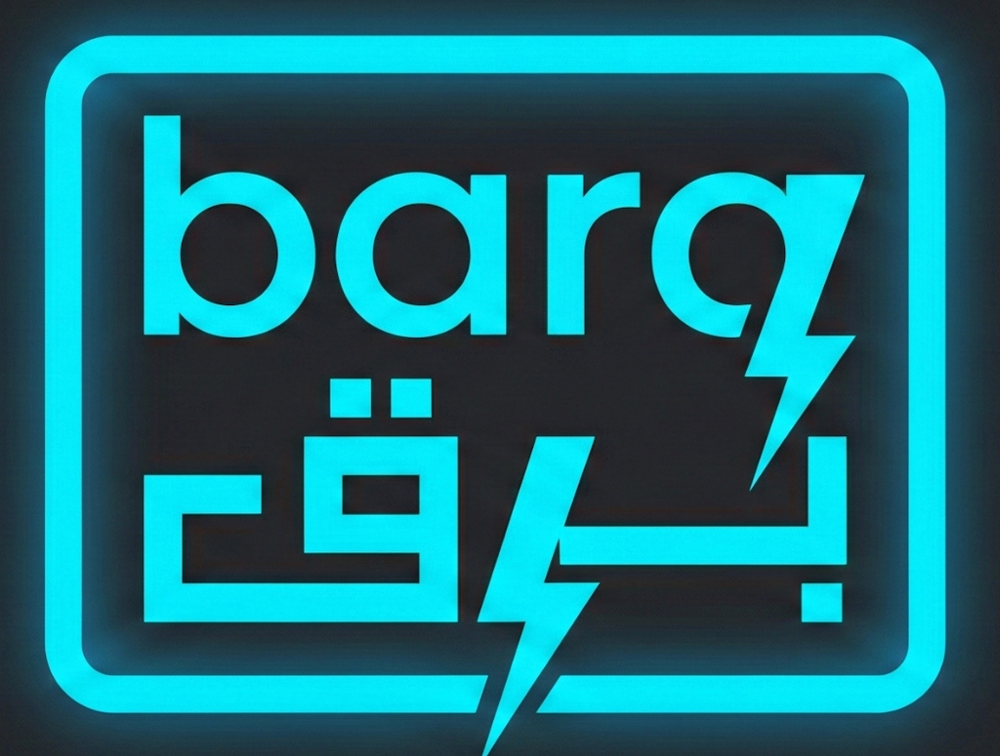
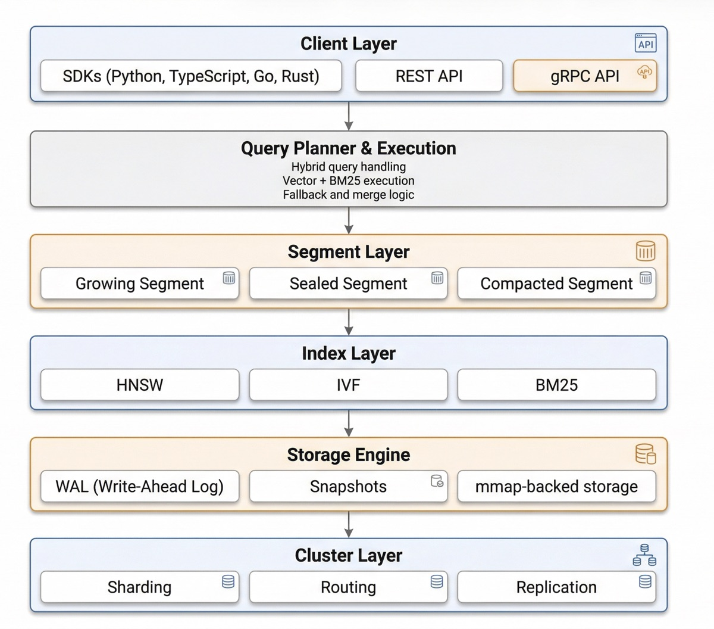

# Barq DB

<p align="center">
  
</p>

<p align="center">
  <b>Retrieval-Focused Data System for AI Applications</b><br/>
  Vector Search · Hybrid Retrieval · Ingestion-Aware Architecture
</p>

<p align="center">
  <a href="https://github.com/YASSERRMD/barq-db/blob/main/LICENSE">
    
  </a>
  <a href="https://github.com/YASSERRMD/barq-db/releases">
    
  </a>
  <a href="https://pypi.org/project/barq-sdk-python/">
    
  </a>
  
  
</p>

---

## Overview

Barq-DB v2 is a retrieval-focused data system built in Rust for modern AI workloads.

It combines:

- Dense vector search  
- BM25 text retrieval  
- Async ingestion pipelines  
- Segment-based storage lifecycle  

into a unified architecture designed for:

- RAG systems  
- semantic search  
- AI-powered recommendations  

---

## Why Barq DB

Barq-DB is designed as a retrieval system rather than a standalone vector store.

Ingestion, indexing, and querying are treated as coordinated stages of a single pipeline, enabling better control over performance, memory usage, and long-running stability.

---

## Key Highlights (v2)

### Memory Control
- Disk-backed vector storage using mmap  
- Configurable memory budgeting and eviction  
- Reduced RAM pressure for large datasets  

### Async Ingestion
- Queue-based ingestion with batching  
- Explicit backpressure handling  
- Stable under sustained write load  

### Segment Lifecycle
- Explicit lifecycle: Growing → Sealed → Compacted  
- Background compaction  
- Improved long-running stability  

### Hybrid Retrieval
- Combined vector similarity and BM25 keyword search  
- Reciprocal Rank Fusion (RRF)  
- Deterministic result merging  

### gRPC-First API
- `proto/barq.proto` is the canonical API contract  
- SDKs aligned to gRPC  
- REST maintained for compatibility  

---

## Architecture

<p align="center">
  
</p>

---

## Storage and Memory Model

- Hot segments and indexes may reside in memory  
- Cold data is accessed through mmap-backed storage  
- Memory usage is bounded through configurable limits  
- Eviction policies prevent uncontrolled memory growth  

---

## Durability Model

- Writes are persisted through WAL before acknowledgment (configurable)  
- Recovery replays WAL into segment state  
- Snapshots and compaction reduce recovery time  

---

## Consistency Model (Current)

- Routed replication provides distribution and redundancy  
- Consistency is not quorum-based in v2  
- This release does not implement full consensus  
- Future versions may introduce stronger consistency guarantees  

---

## Benchmarking

Barq-DB v2 includes built-in benchmarking tools.

Designed to evaluate:

- Ingestion throughput  
- Query latency (p50 / p95 / p99)  
- Memory usage under load  

Supports dataset simulations at scale (1M, 10M, and higher).

---

## API and SDK

Barq-DB v2 introduces a gRPC-first architecture.

- gRPC is the primary API surface  
- REST is maintained for compatibility  
- SDKs available in:
  - Python  
  - TypeScript  
  - Go  
  - Rust  

### SDK Compatibility

- No breaking changes to existing SDK methods  
- New features exposed via optional parameters  

### New Capabilities

- Insert options:
  - wait_for_commit  
- Search options:
  - allow_fallback  
  - consistency  
- Async ingestion support  
- Metrics and admin APIs  

---

## Quick Start

### Run with Docker

```bash
docker-compose up -d
````

### Run from Source

```bash
cargo run --bin barq-server
```

Endpoints:

* HTTP: [http://localhost:8080](http://localhost:8080)
* gRPC: localhost:50051

---

## Example (Python)

```python
from barq import BarqClient

client = BarqClient("http://localhost:8080", api_key="your-key")

client.create_collection(name="products", dimension=384, metric="Cosine")

client.insert_document(
    collection="products",
    id=1,
    vector=[0.1, 0.2, ...],
    payload={"name": "Widget"}
)

results = client.search(collection="products", vector=query_vector, top_k=10)
```

---

## Project Structure

| Crate        | Description                 |
| ------------ | --------------------------- |
| barq-core    | Data structures and catalog |
| barq-index   | HNSW, IVF, SIMD kernels     |
| barq-bm25    | Text search engine          |
| barq-storage | WAL, snapshots, persistence |
| barq-cluster | Sharding and routing        |
| barq-api     | gRPC and REST APIs          |

---

## Reality Check

Barq-DB v2 introduces a stronger and more structured architecture.

However, it still requires continued validation under real-world workloads, particularly for large-scale and distributed scenarios.

---

## License

MIT License
